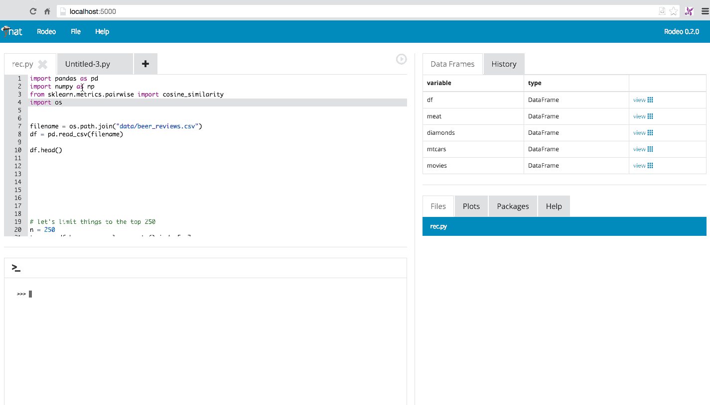
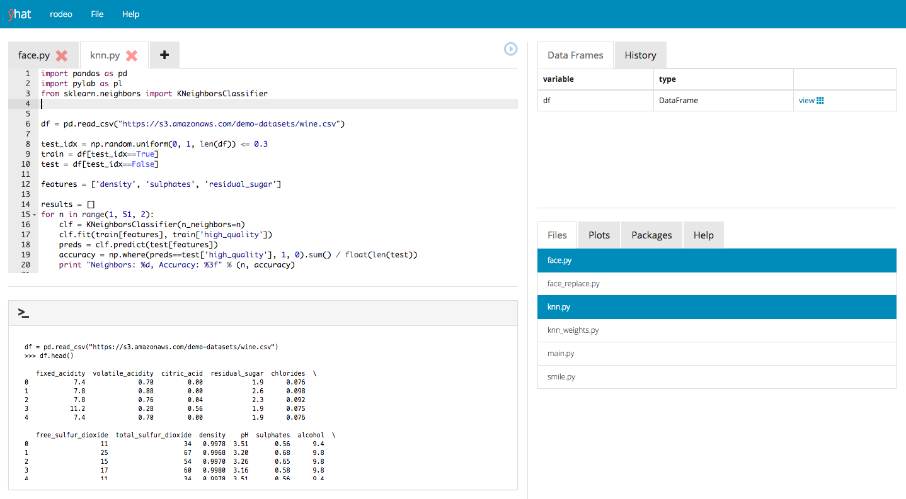
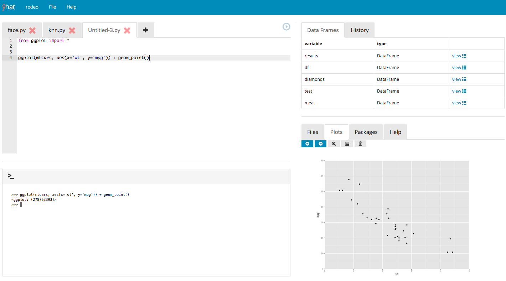
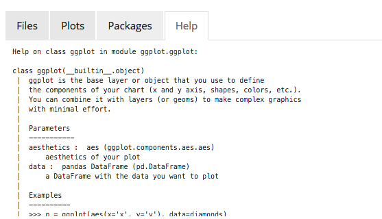

`Rodeo <http://blog.yhathq.com/posts/introducing-rodeo.html>`__
===============================================================

::

     $ pip install -U rodeo
     $ rodeo .
     
      _______      ___   ______   ________    ___
     |_   __ \   .'   `.|_   _ `.|_   __  | .'   `.
       | |__) | /  .-.  \ | | `. \ | |_ \_|/  .-.  \
       |  __ /  | |   | | | |  | | |  _| _ | |   | |
      _| |  \ \_\  `-'  /_| |_.' /_| |__/ |\  `-'  /
     |____| |___|`.___.'|______.'|________| `.___.'
     
     ''''''''''''''''''''''''''''''''''''''''''''''''''
       URL: http://localhost:5000
       DIRECTORY: /Users/glamp/repos/yhat/big-data/kung-foo
     ''''''''''''''''''''''''''''''''''''''''''''''''''

Rodeo is a data centric IDE for Python. You can think of it as an
alternative UI to the notebook for the IPython Kernel. It's heavily
inspired by great projects like Sublime Text and Eclipse.

Quickstart
----------

.. code:: bash

    $ pip install rodeo 
    $ rodeo .

Important shortcuts
-------------------

-  Tab is autocomplete
-  ⌘ + *enter* is send code to terminal
-  ctrl + 1 jumps the cursor to the editor
-  ctrl + 2 jumps the cursor to the console

Features
--------

Execute scripts
^^^^^^^^^^^^^^^

|image0| #### Run analysis |image1| #### Autocomplete |image2| ####
Inspect your data |image3| #### Plots |image4| #### Documentation and
Help |image5|

.. |image1| image:: ./rodeo/static/img/screenshot-mpl-complex.png
.. |image2| image:: ./rodeo/static/img/screenshot-autocomplete.png
.. |image3| image:: ./rodeo/static/img/screenshot-view-data.png

